# Title

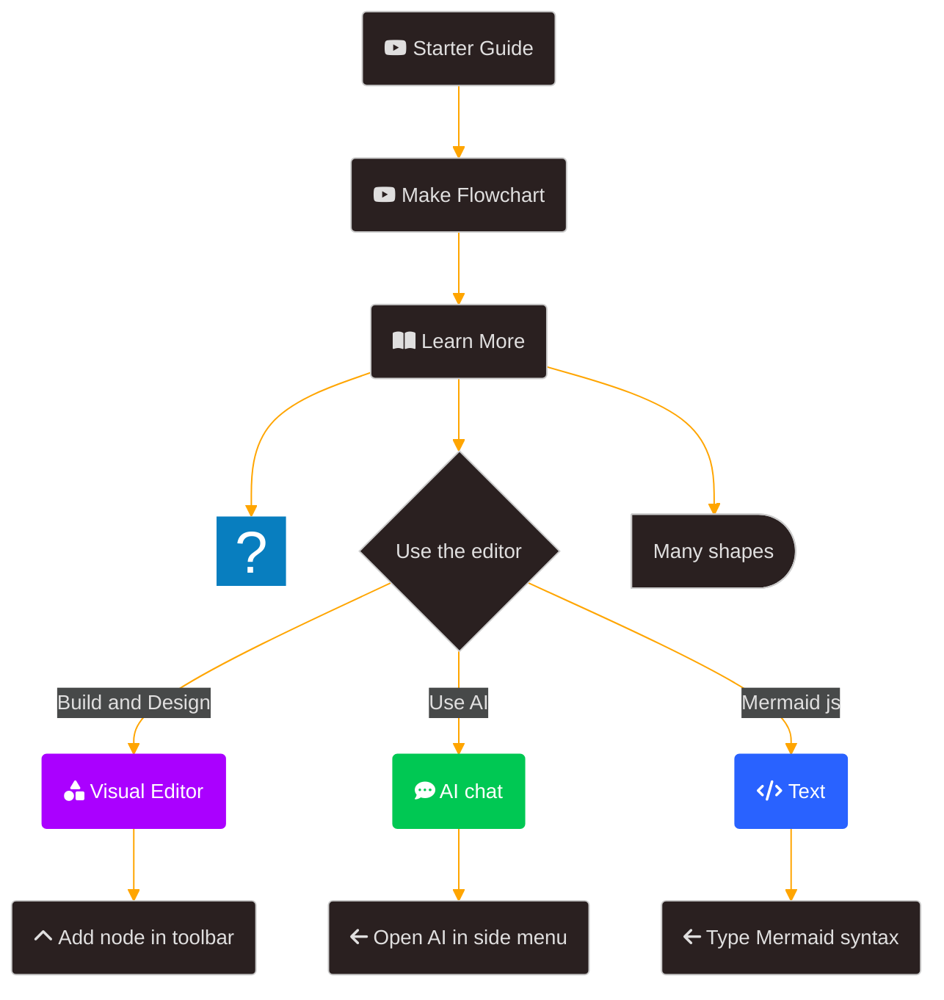
```mermaid
---
config:
  theme: neo-dark
  themeCSS:
    - .cardinality text { fill: #ededed }
  themeVariables:
    primaryTextColor: #ededed
    nodeBorder: #393939
    mainBkg: #292929
    lineColor: orange
---
flowchart TD
    %% Nodes
        A("fab:fa-youtube Starter Guide")
        B("fab:fa-youtube Make Flowchart")
        n1@{ icon: "fa:gem", pos: "b", h: 24}
        C("fa:fa-book-open Learn More")
        D{"Use the editor"}
        n2(Many shapes)@{ shape: delay}
        E(fa:fa-shapes Visual Editor)
        F("fa:fa-chevron-up Add node in toolbar")
        G("fa:fa-comment-dots AI chat")
        H("fa:fa-arrow-left Open AI in side menu")
        I("fa:fa-code Text")
        J(fa:fa-arrow-left Type Mermaid syntax)

    %% Edge connections between nodes
        A --> B --> C --> n1 & D & n2
        D -- Build and Design --> E --> F
        D -- Use AI --> G --> H
        D -- Mermaid js --> I --> J

    %% Individual node styling. Try the visual editor toolbar for easier styling!
        style E color:#FFFFFF, fill:#AA00FF, stroke:#AA00FF
        style G color:#FFFFFF, stroke:#00C853, fill:#00C853
        style I color:#FFFFFF, stroke:#2962FF, fill:#2962FF

    %% You can add notes with two "%" signs in a row!
```

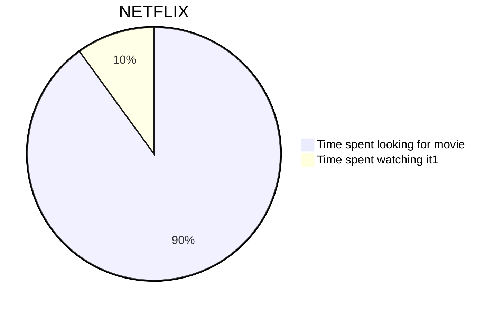
```mermaid
pie title NETFLIX
         "Time spent looking for movie" : 90
         "Time spent watching it1" : 10
```

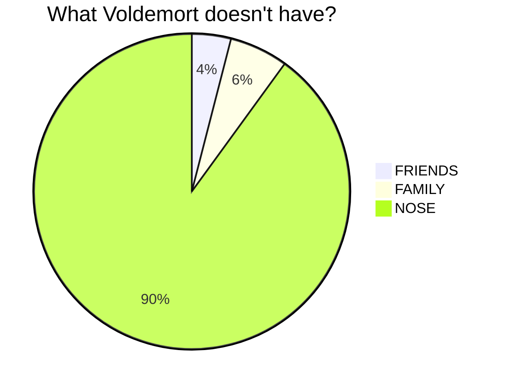
```mermaid
pie title What Voldemort doesn't have?
         "FRIENDS" : 2
         "FAMILY" : 3
         "NOSE" : 45
```

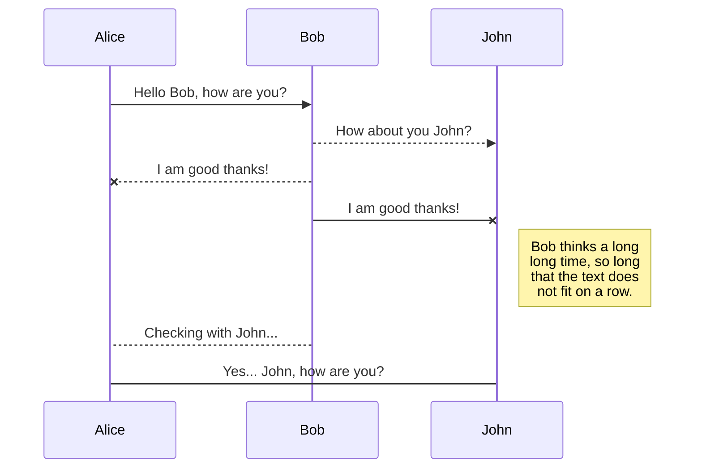
```mermaid
sequenceDiagram
    Alice ->> Bob: Hello Bob, how are you?
    Bob-->>John: How about you John?
    Bob--x Alice: I am good thanks!
    Bob-x John: I am good thanks!
    Note right of John: Bob thinks a long<br/>long time, so long<br/>that the text does<br/>not fit on a row.

    Bob-->Alice: Checking with John...
    Alice->John: Yes... John, how are you?
```

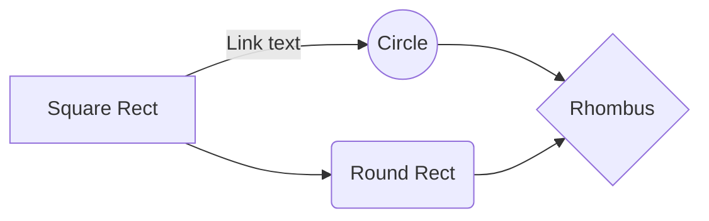
```mermaid
graph LR
    A[Square Rect] -- Link text --> B((Circle))
    A --> C(Round Rect)
    B --> D{Rhombus}
    C --> D
```

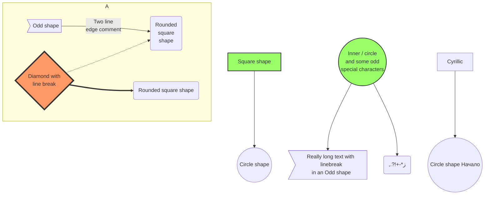
```mermaid
graph TB
    sq[Square shape] --> ci((Circle shape))

    subgraph A
        od>Odd shape]-- Two line<br/>edge comment --> ro
        di{Diamond with <br/> line break} -.-> ro(Rounded<br>square<br>shape)
        di==>ro2(Rounded square shape)
    end

    %% Notice that no text in shape are added here instead that is appended further down
    e --> od3>Really long text with linebreak<br>in an Odd shape]

    %% Comments after double percent signs
    e((Inner / circle<br>and some odd <br>special characters)) --> f(,.?!+-*ز)

    cyr[Cyrillic]-->cyr2((Circle shape Начало));

    classDef green fill:#9f6,stroke:#333,stroke-width:2px,color:#333;
    classDef orange fill:#f96,stroke:#333,stroke-width:4px,color:#333;
    class sq,e green
    class di orange

```

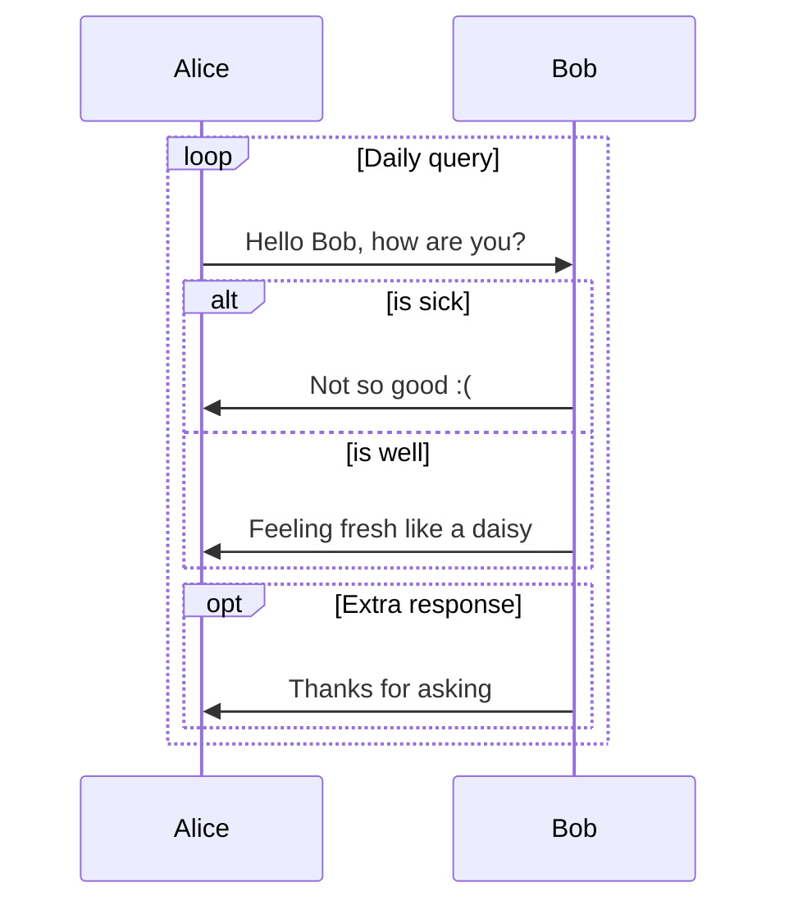
```mermaid
sequenceDiagram
    loop Daily query
        Alice->>Bob: Hello Bob, how are you?
        alt is sick
            Bob->>Alice: Not so good :(
        else is well
            Bob->>Alice: Feeling fresh like a daisy
        end

        opt Extra response
            Bob->>Alice: Thanks for asking
        end
    end
```

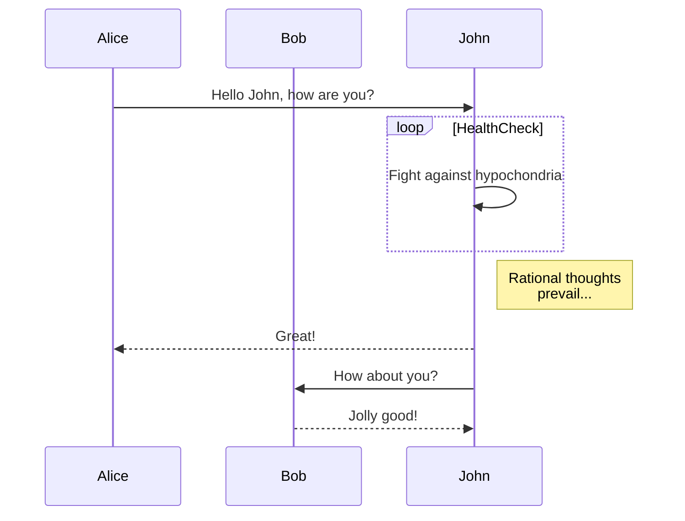
```mermaid
sequenceDiagram
    participant Alice
    participant Bob
    Alice->>John: Hello John, how are you?
    loop HealthCheck
        John->>John: Fight against hypochondria
    end
    Note right of John: Rational thoughts<br/>prevail...
    John-->>Alice: Great!
    John->>Bob: How about you?
    Bob-->>John: Jolly good!
```

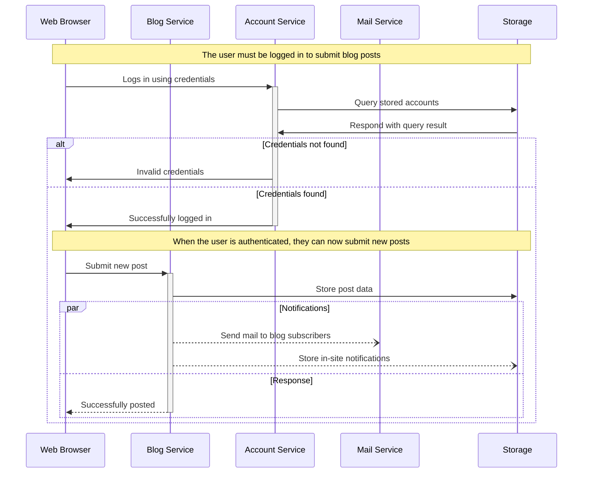
```mermaid
sequenceDiagram
    participant web as Web Browser
    participant blog as Blog Service
    participant account as Account Service
    participant mail as Mail Service
    participant db as Storage

    Note over web,db: The user must be logged in to submit blog posts
    web->>+account: Logs in using credentials
    account->>db: Query stored accounts
    db->>account: Respond with query result

    alt Credentials not found
        account->>web: Invalid credentials
    else Credentials found
        account->>-web: Successfully logged in

        Note over web,db: When the user is authenticated, they can now submit new posts
        web->>+blog: Submit new post
        blog->>db: Store post data

        par Notifications
            blog--)mail: Send mail to blog subscribers
            blog--)db: Store in-site notifications
        and Response
            blog-->>-web: Successfully posted
        end
    end
```

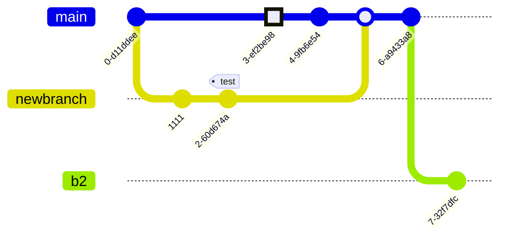
```mermaid
gitGraph:
    commit "Ashish"
    branch newbranch
    checkout newbranch
    commit id:"1111"
    commit tag:"test"
    checkout main
    commit type: HIGHLIGHT
    commit
    merge newbranch
    commit
    branch b2
    commit
```

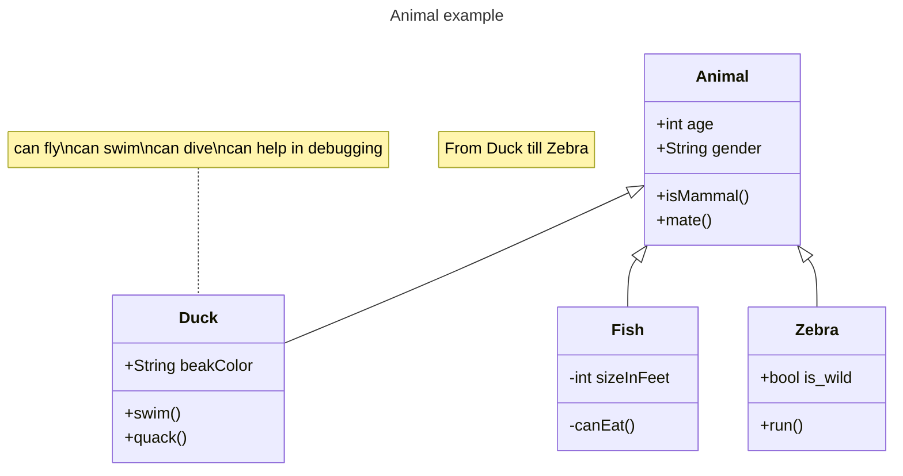
```mermaid
---
title: Animal example
---
classDiagram
    note "From Duck till Zebra"
    Animal <|-- Duck
    note for Duck "can fly\ncan swim\ncan dive\ncan help in debugging"
    Animal <|-- Fish
    Animal <|-- Zebra
    Animal : +int age
    Animal : +String gender
    Animal: +isMammal()
    Animal: +mate()
    class Duck{
        +String beakColor
        +swim()
        +quack()
    }
    class Fish{
        -int sizeInFeet
        -canEat()
    }
    class Zebra{
        +bool is_wild
        +run()
    }
```

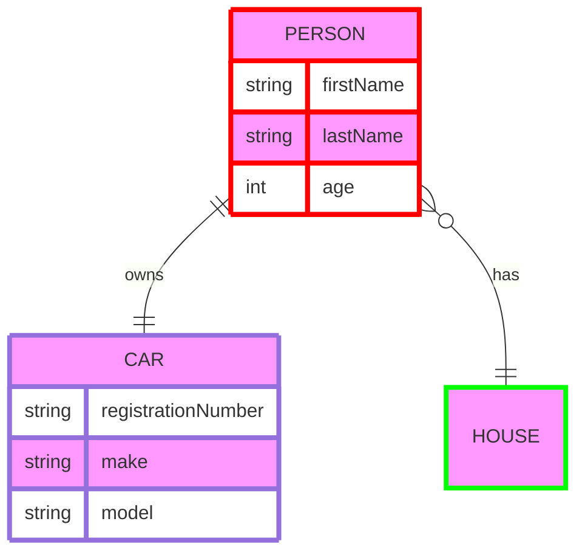
```mermaid
erDiagram
    CAR {
        string registrationNumber
        string make
        string model
    }
    PERSON {
        string firstName
        string lastName
        int age
    }
    PERSON:::foo ||--|| CAR : owns
    PERSON o{--|| HOUSE:::bar : has

    classDef default fill:#f9f,stroke-width:4px
    classDef foo stroke:#f00
    classDef bar stroke:#0f0
    classDef foobar stroke:#00f
```

```mermaid
erDiagram
    CAR {
        string registrationNumber
        string make
        string model
    }
    PERSON {
        string firstName
        string lastName
        int age
    }
    PERSON:::foo ||--|| CAR : owns
    PERSON o{--|| HOUSE:::bar : has

    classDef default fill:#f9f,stroke-width:4px
    classDef foo stroke:#f00
    classDef bar stroke:#0f0
    classDef foobar stroke:#00f
```

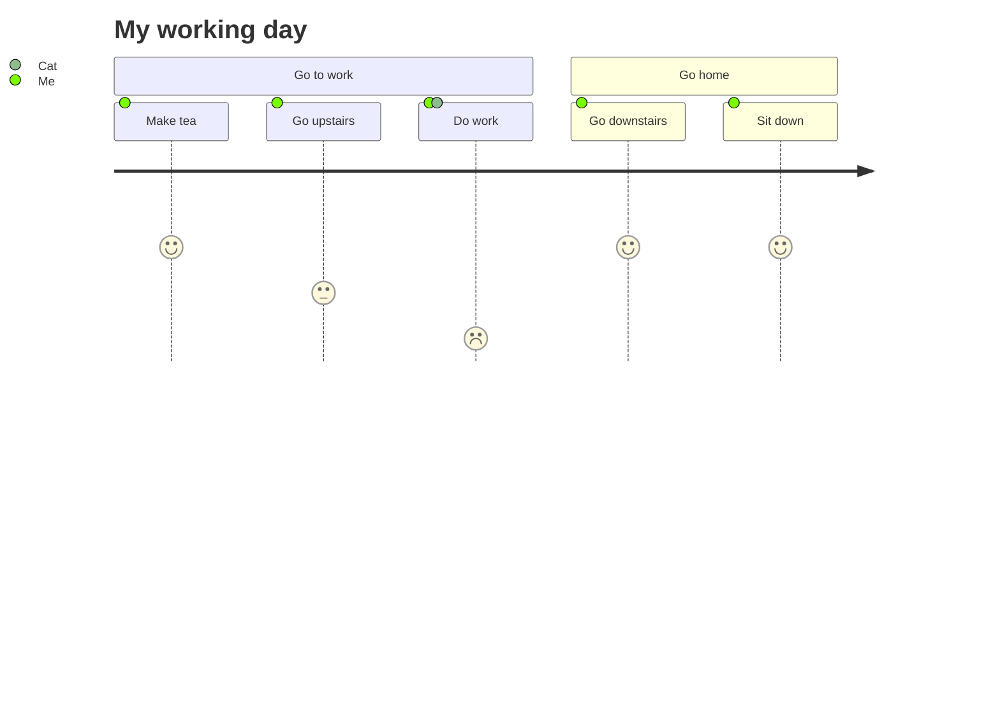
```mermaid
journey
    title My working day
    section Go to work
      Make tea: 5: Me
      Go upstairs: 3: Me
      Do work: 1: Me, Cat
    section Go home
      Go downstairs: 5: Me
      Sit down: 5: Me
```

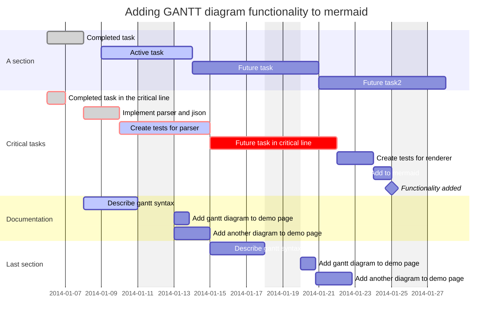
```mermaid
gantt
    dateFormat  YYYY-MM-DD
    title       Adding GANTT diagram functionality to mermaid
    excludes    weekends
    %% (`excludes` accepts specific dates in YYYY-MM-DD format, days of the week ("sunday") or "weekends", but not the word "weekdays".)

    section A section
    Completed task            :done,    des1, 2014-01-06,2014-01-08
    Active task               :active,  des2, 2014-01-09, 3d
    Future task               :         des3, after des2, 5d
    Future task2              :         des4, after des3, 5d

    section Critical tasks
    Completed task in the critical line :crit, done, 2014-01-06,24h
    Implement parser and jison          :crit, done, after des1, 2d
    Create tests for parser             :crit, active, 3d
    Future task in critical line        :crit, 5d
    Create tests for renderer           :2d
    Add to mermaid                      :until isadded
    Functionality added                 :milestone, isadded, 2014-01-25, 0d

    section Documentation
    Describe gantt syntax               :active, a1, after des1, 3d
    Add gantt diagram to demo page      :after a1  , 20h
    Add another diagram to demo page    :doc1, after a1  , 48h

    section Last section
    Describe gantt syntax               :after doc1, 3d
    Add gantt diagram to demo page      :20h
    Add another diagram to demo page    :48h
```

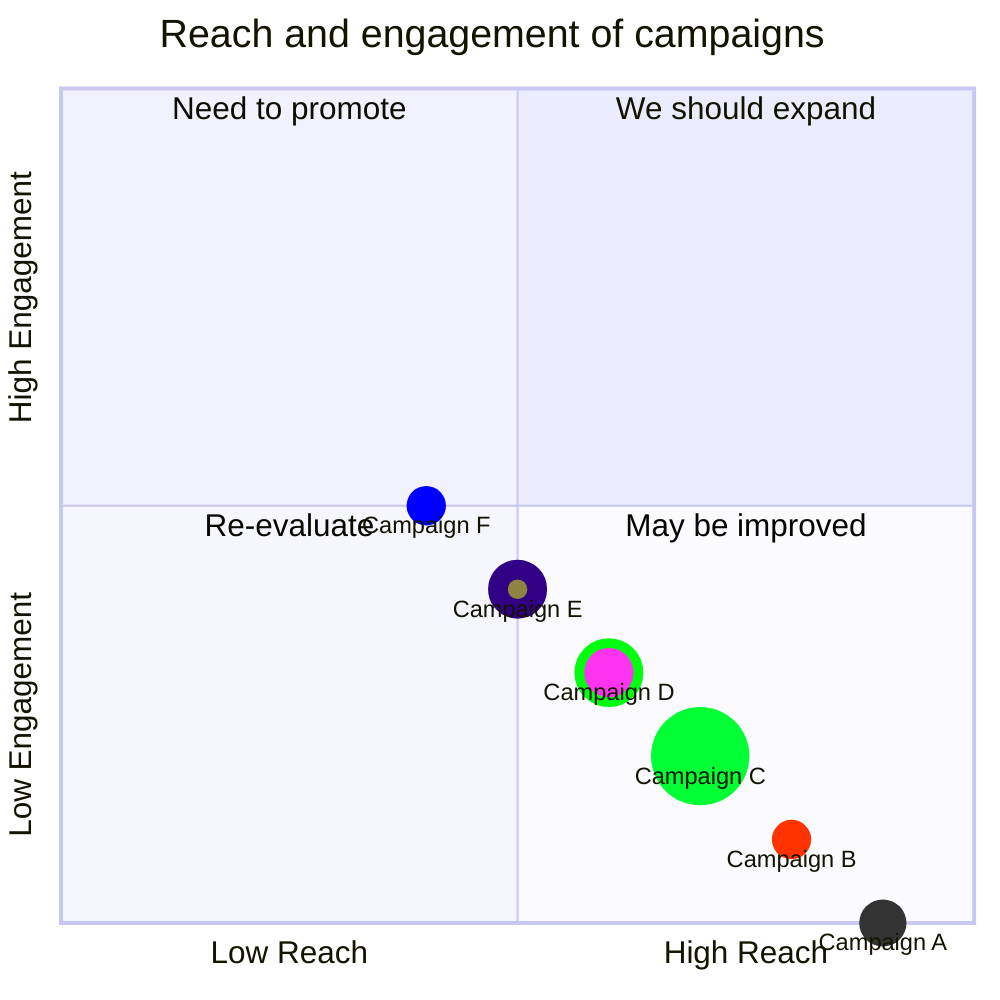
```mermaid
quadrantChart
  title Reach and engagement of campaigns
  x-axis Low Reach --> High Reach
  y-axis Low Engagement --> High Engagement
  quadrant-1 We should expand
  quadrant-2 Need to promote
  quadrant-3 Re-evaluate
  quadrant-4 May be improved
  Campaign A: [0.9, 0.0] radius: 12
  Campaign B:::class1: [0.8, 0.1] color: #ff3300, radius: 10
  Campaign C: [0.7, 0.2] radius: 25, color: #00ff33, stroke-color: #10f0f0
  Campaign D: [0.6, 0.3] radius: 15, stroke-color: #00ff0f, stroke-width: 5px ,color: #ff33f0
  Campaign E:::class2: [0.5, 0.4]
  Campaign F:::class3: [0.4, 0.5] color: #0000ff
  classDef class1 color: #109060
  classDef class2 color: #908342, radius : 10, stroke-color: #310085, stroke-width: 10px
  classDef class3 color: #f00fff, radius : 10
```

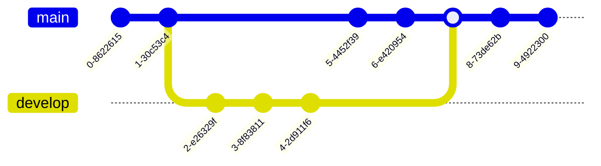
```mermaid
    gitGraph
       commit
       commit
       branch develop
       commit
       commit
       commit
       checkout main
       commit
       commit
       merge develop
       commit
       commit
```

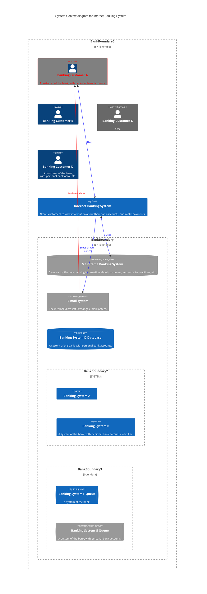
```mermaid
    C4Context
      title System Context diagram for Internet Banking System
      Enterprise_Boundary(b0, "BankBoundary0") {
        Person(customerA, "Banking Customer A", "A customer of the bank, with personal bank accounts.")
        Person(customerB, "Banking Customer B")
        Person_Ext(customerC, "Banking Customer C", "desc")

        Person(customerD, "Banking Customer D", "A customer of the bank, <br/> with personal bank accounts.")

        System(SystemAA, "Internet Banking System", "Allows customers to view information about their bank accounts, and make payments.")

        Enterprise_Boundary(b1, "BankBoundary") {

          SystemDb_Ext(SystemE, "Mainframe Banking System", "Stores all of the core banking information about customers, accounts, transactions, etc.")

          System_Boundary(b2, "BankBoundary2") {
            System(SystemA, "Banking System A")
            System(SystemB, "Banking System B", "A system of the bank, with personal bank accounts. next line.")
          }

          System_Ext(SystemC, "E-mail system", "The internal Microsoft Exchange e-mail system.")
          SystemDb(SystemD, "Banking System D Database", "A system of the bank, with personal bank accounts.")

          Boundary(b3, "BankBoundary3", "boundary") {
            SystemQueue(SystemF, "Banking System F Queue", "A system of the bank.")
            SystemQueue_Ext(SystemG, "Banking System G Queue", "A system of the bank, with personal bank accounts.")
          }
        }
      }

      BiRel(customerA, SystemAA, "Uses")
      BiRel(SystemAA, SystemE, "Uses")
      Rel(SystemAA, SystemC, "Sends e-mails", "SMTP")
      Rel(SystemC, customerA, "Sends e-mails to")

      UpdateElementStyle(customerA, $fontColor="red", $bgColor="grey", $borderColor="red")
      UpdateRelStyle(customerA, SystemAA, $textColor="blue", $lineColor="blue", $offsetX="5")
      UpdateRelStyle(SystemAA, SystemE, $textColor="blue", $lineColor="blue", $offsetY="-10")
      UpdateRelStyle(SystemAA, SystemC, $textColor="blue", $lineColor="blue", $offsetY="-40", $offsetX="-50")
      UpdateRelStyle(SystemC, customerA, $textColor="red", $lineColor="red", $offsetX="-50", $offsetY="20")

      UpdateLayoutConfig($c4ShapeInRow="3", $c4BoundaryInRow="1")
```

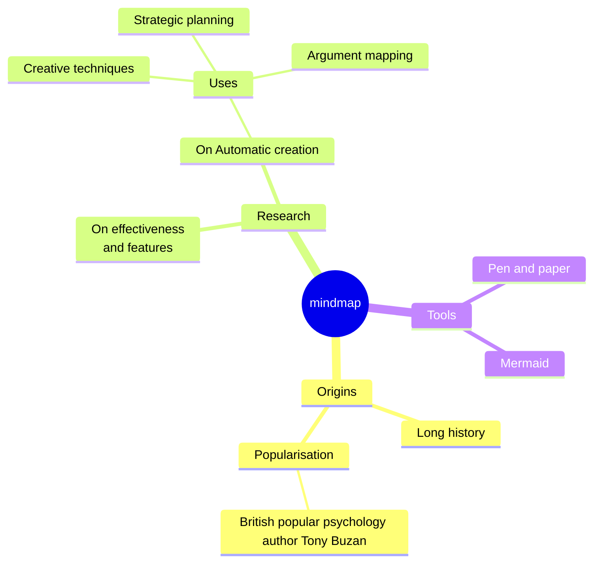
```mermaid
mindmap
  root((mindmap))
    Origins
      Long history
      ::icon(fa fa-book)
      Popularisation
        British popular psychology author Tony Buzan
    Research
      On effectiveness<br/>and features
      On Automatic creation
        Uses
            Creative techniques
            Strategic planning
            Argument mapping
    Tools
      Pen and paper
      Mermaid
```

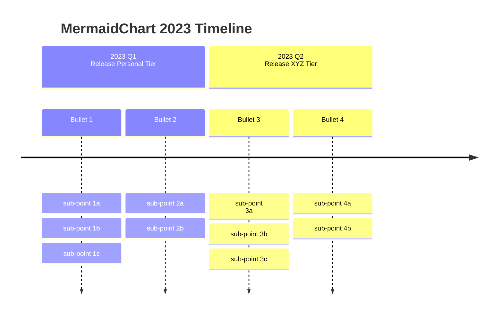
```mermaid
timeline
        title MermaidChart 2023 Timeline
        section 2023 Q1 <br> Release Personal Tier
          Bullet 1 : sub-point 1a : sub-point 1b
               : sub-point 1c
          Bullet 2 : sub-point 2a : sub-point 2b
        section 2023 Q2 <br> Release XYZ Tier
          Bullet 3 : sub-point <br> 3a : sub-point 3b
               : sub-point 3c
          Bullet 4 : sub-point 4a : sub-point 4b
```

```mermaid
zenuml
    // 1. assign a variable from a sync message.
    a = A.SyncMessage()

    // 1.1. optionally give the variable a type
    SomeType a = A.SyncMessage()

    // 2. use return keyword
    A.SyncMessage() {
    return result
    }

    // 3. use @return or @reply annotator on an async message
    @return
    A->B: result
```

```mermaid
zenuml
    title Demo
    Alice->John: Hello John, how are you?
    John->Alice: Great!
    Alice->John: See you later!
```

```mermaid
---
config:
  sankey:
    showValues: false
---
sankey-beta

Agricultural 'waste',Bio-conversion,124.729
Bio-conversion,Liquid,0.597
Bio-conversion,Losses,26.862
Bio-conversion,Solid,280.322
Bio-conversion,Gas,81.144
Biofuel imports,Liquid,35
Biomass imports,Solid,35
Coal imports,Coal,11.606
Coal reserves,Coal,63.965
Coal,Solid,75.571
District heating,Industry,10.639
District heating,Heating and cooling - commercial,22.505
District heating,Heating and cooling - homes,46.184
Electricity grid,Over generation / exports,104.453
Electricity grid,Heating and cooling - homes,113.726
Electricity grid,H2 conversion,27.14
Electricity grid,Industry,342.165
Electricity grid,Road transport,37.797
Electricity grid,Agriculture,4.412
Electricity grid,Heating and cooling - commercial,40.858
Electricity grid,Losses,56.691
Electricity grid,Rail transport,7.863
Electricity grid,Lighting & appliances - commercial,90.008
Electricity grid,Lighting & appliances - homes,93.494
Gas imports,Ngas,40.719
Gas reserves,Ngas,82.233
Gas,Heating and cooling - commercial,0.129
Gas,Losses,1.401
Gas,Thermal generation,151.891
Gas,Agriculture,2.096
Gas,Industry,48.58
Geothermal,Electricity grid,7.013
H2 conversion,H2,20.897
H2 conversion,Losses,6.242
H2,Road transport,20.897
Hydro,Electricity grid,6.995
Liquid,Industry,121.066
Liquid,International shipping,128.69
Liquid,Road transport,135.835
Liquid,Domestic aviation,14.458
Liquid,International aviation,206.267
Liquid,Agriculture,3.64
Liquid,National navigation,33.218
Liquid,Rail transport,4.413
Marine algae,Bio-conversion,4.375
Ngas,Gas,122.952
Nuclear,Thermal generation,839.978
Oil imports,Oil,504.287
Oil reserves,Oil,107.703
Oil,Liquid,611.99
Other waste,Solid,56.587
Other waste,Bio-conversion,77.81
Pumped heat,Heating and cooling - homes,193.026
Pumped heat,Heating and cooling - commercial,70.672
Solar PV,Electricity grid,59.901
Solar Thermal,Heating and cooling - homes,19.263
Solar,Solar Thermal,19.263
Solar,Solar PV,59.901
Solid,Agriculture,0.882
Solid,Thermal generation,400.12
Solid,Industry,46.477
Thermal generation,Electricity grid,525.531
Thermal generation,Losses,787.129
Thermal generation,District heating,79.329
Tidal,Electricity grid,9.452
UK land based bioenergy,Bio-conversion,182.01
Wave,Electricity grid,19.013
Wind,Electricity grid,289.366
```

```mermaid
---
config:
    xyChart:
        width: 900
        height: 600
        showDataLabel: true
    themeVariables:
        xyChart:
            titleColor: "#ff0000"
---
xychart-beta
    title "Sales Revenue"
    x-axis [jan, feb, mar, apr, may, jun, jul, aug, sep, oct, nov, dec]
    y-axis "Revenue (in $)" 4000 --> 11000
    bar [5000, 6000, 7500, 8200, 9500, 10500, 11000, 10200, 9200, 8500, 7000, 6000]
    line [5000, 6000, 7500, 8200, 9500, 10500, 11000, 10200, 9200, 8500, 7000, 6000]
```

```mermaid
block-beta
  columns 3
  Frontend blockArrowId6<[" "]>(right) Backend
  space:2 down<[" "]>(down)
  Disk left<[" "]>(left) Database[("Database")]

  classDef front fill:#696,stroke:#333;
  classDef back fill:#969,stroke:#333;
  class Frontend front
  class Backend,Database back
```

```mermaid
---
title: "TCP Packet"
---
packet-beta
0-15: "Source Port"
16-31: "Destination Port"
32-63: "Sequence Number"
64-95: "Acknowledgment Number"
96-99: "Data Offset"
100-105: "Reserved"
106: "URG"
107: "ACK"
108: "PSH"
109: "RST"
110: "SYN"
111: "FIN"
112-127: "Window"
128-143: "Checksum"
144-159: "Urgent Pointer"
160-191: "(Options and Padding)"
192-255: "Data (variable length)"
```

```mermaid
---
config:
  kanban:
    ticketBaseUrl: 'https://mermaidchart.atlassian.net/browse/#TICKET#'
---
kanban
  Todo
    [Create Documentation]
    docs[Create Blog about the new diagram]
  [In progress]
    id6[Create renderer so that it works in all cases. We also add some extra text here for testing purposes. And some more just for the extra flare.]
  id9[Ready for deploy]
    id8[Design grammar]@{ assigned: 'knsv' }
  id10[Ready for test]
    id4[Create parsing tests]@{ ticket: MC-2038, assigned: 'K.Sveidqvist', priority: 'High' }
    id66[last item]@{ priority: 'Very Low', assigned: 'knsv' }
  id11[Done]
    id5[define getData]
    id2[Title of diagram is more than 100 chars when user duplicates diagram with 100 char]@{ ticket: MC-2036, priority: 'Very High'}
    id3[Update DB function]@{ ticket: MC-2037, assigned: knsv, priority: 'High' }

  id12[Can't reproduce]
    id3[Weird flickering in Firefox]
```

```mermaid
architecture-beta
    group api(cloud)[API]

    service db(database)[Database] in api
    service disk1(disk)[Storage] in api
    service disk2(disk)[Storage] in api
    service server(server)[Server] in api

    db:L -- R:server
    disk1:T -- B:server
    disk2:T -- B:db
```

```mermaid
---
title: "Grades"
---
radar-beta
  axis m["Math"], s["Science"], e["English"]
  axis h["History"], g["Geography"], a["Art"]
  curve a["Alice"]{85, 90, 80, 70, 75, 90}
  curve b["Bob"]{70, 75, 85, 80, 90, 85}

  max 100
  min 0
```

```mermaid
---
config:
  radar:
    axisScaleFactor: 0.25
    curveTension: 0.1
  theme: base
  themeVariables:
    cScale0: "#FF0000"
    cScale1: "#00FF00"
    cScale2: "#0000FF"
    radar:
      curveOpacity: 0
---
radar-beta
  axis A, B, C, D, E
  curve c1{1,2,3,4,5}
  curve c2{5,4,3,2,1}
  curve c3{3,3,3,3,3}
```

```mermaid
---
config:
  treemap:
    valueFormat: '$0,0'
---
treemap-beta
"Budget"
    "Operations"
        "Salaries": 700000
        "Equipment": 200000
        "Supplies": 100000
    "Marketing"
        "Advertising": 400000
        "Events": 100000
```

```mermaid
flowchart LR
    A["$$x^2$$"] --> B["Area $$\frac{\pi r^2}{2}$$"]
    B --> C["fa:fa-code Math and icons"]
```

```mermaid
sequenceDiagram
    participant A as Alice
    participant B as Bob
    A->>B: Solve $$x^2 + y^2 = z^2$$
    Note over A,B: $$\int_0^1 x^2\,dx$$
```

```mermaid
stateDiagram-v2
    state "$$E = mc^2$$" as energy
    [*] --> energy
    energy --> [*]: $$t \to \infty$$
```

```mermaid
flowchart LR
    A["$$\unknowncommand$$"] --> B["Unresolved TeX stays as text"]
```

## Pele 1.9 features

### Rich label HTML

```mermaid
flowchart LR
    H["H<sub>2</sub>O and x<sup>2</sup>"] --> M["<code>code()</code> <kbd>Ctrl</kbd> <samp>out</samp> <tt>mono</tt>"]
    M --> D["<u>under</u> <ins>inserted</ins> <var>x</var> <cite>book</cite> <dfn>term</dfn>"]
    D --> L["List<T> stays literal"]
```

### Soft hyphen and zero-width wrapping

```mermaid
flowchart LR
    %% U+200B is the invisible character between "zero" and "width".
    A["A long label with a soft&shy;hyphen and a zero​width space"] --> B["Wrapped by Pele"]
```

### State transition curves

```mermaid
---
config:
  flowchart:
    curve: basis
---
stateDiagram-v2
    [*] --> Idle
    Idle --> Running: start
    Running --> Idle: stop
    Running --> [*]
```

## Pele 1.10 features

### Comment directly after a token

```mermaid
venn-beta
    set A%% note directly after the token
    set B
    union A,B
```

### Comments in quadrant and XY charts

```mermaid
quadrantChart
    title Inline comments
    x-axis Low --> High
    y-axis Low --> High
    Campaign A: [0.8, 0.2]%% keeps the bracket
    Campaign B: [0.2, 0.8]
```

```mermaid
---
config:
  xyChart:
    showDataLabel: true
---
xychart-beta
    title "Inline comment after bar"
    x-axis [a, b, c]
    y-axis "Value" 0 --> 10
    bar [4, 6, 8]%% keeps the bracket
```

### Empty title

```mermaid
sequenceDiagram
    title
    Alice->>Bob: The title line is empty
```

### Sankey value formatting

```mermaid
---
config:
  sankey:
    showValues: true
    prefix: "&#8776;"
    suffix: "&nbsp;%"
---
sankey-beta
Énergie,Chaleur,50%
Chaleur,Logements,25
Logements,Losses,25
```

### XY chart with collapsed y bounds

```mermaid
xychart-beta
    title "Collapsed y bounds"
    x-axis [a, b, c]
    y-axis "Value" 10 --> 10
    bar [3, 5, 7]
```

## Pele 1.10.1 fixes

### Subgraph direction with outward links

```mermaid
flowchart LR
    subgraph S["Sources"]
        direction TB
        s1[Files]
        s2[Database]
        s3[API]
        s4[Events]
    end
    subgraph P["Processing"]
        direction TB
        p1[Validate]
        p2[Transform]
        p3[Aggregate]
    end
    subgraph O["Outputs"]
        direction TB
        o1[Dashboard]
        o2[Report]
    end
    s1 --> p2
    s2 --> p1
    s3 --> p1
    s4 --> p3
    p1 --> o1
    p2 --> o1
    p3 --> o2
```

### Keyword-prefixed names

```mermaid
venn-beta
    set set-theory
    set text-books
    union set-theory,text-books["both"]
```

```mermaid
radar-beta
    axis circles, trueNorth, titles
    curve sample{circles: 1, trueNorth: 2, titles: 3}
    max 3
    min 0
```

```mermaid
architecture-beta
    service titles(cloud)[Titles]
```

```mermaid
gitGraph
    commit
    branch titles
    checkout titles
    commit
```

```mermaid
treemap-beta
    "titles": 10
    "other": 5
```

### Sankey rows with surrounding whitespace

```mermaid
sankey-beta

  A, B, 5
  B, C, 3

```

### Quadrant labels with empty quadrant labels

```mermaid
quadrantChart
    title Empty quadrant labels
    P: [0.25, 0.4375]
    Q: [0.25, 0.4175]
```

## Pele 1.11 features

### Parallel block edge labels

```mermaid
block-beta
    columns 2
    A["A"] B["B"]
    A-- "forward" -->B
    A-- "reverse" -->B
```

### Crowded treemap

```mermaid
treemap-beta
    "Root"
        "Tiny section"
            "A": 100
            "B": 100
        "Large section"
            "C": 1000
```

## Pele 1.12 features

### Contrast-aware labels on explicit fills

```mermaid
flowchart LR
    A[Light fill]
    B[Dark fill]
    C[Warm class]
    D[Cool class]
    A --> B
    B --> C
    C --> D
    style A fill:#f5e0b8,stroke:#b58b3a
    style B fill:#263238,stroke:#546e7a
    classDef warm fill:#ffd54f,stroke:#a67c00
    classDef cool fill:#0d47a1,stroke:#82aaff
    class C warm
    class D cool
```

```mermaid
sequenceDiagram
    participant Alice
    participant Bob
    rect rgb(255, 213, 79)
        Alice->>Bob: Light fill
    end
    rect rgb(13, 71, 161)
        Alice->>Bob: Dark fill
    end
```

### Full-opacity subgraph fills

```mermaid
flowchart LR
    subgraph S["Filled subgraph"]
        direction TB
        A --> B
    end
    style S fill:#ffd54f,stroke:#a67c00
```

### Percent escapes in links

```mermaid
flowchart LR
    A[Search link] --> B
    click A "https://example.com/search?q=a%20b&x=1%26y"
```

## Pele 1.13 features

### Mermaid palette colors

```mermaid
---
config:
  themeVariables:
    pie1: '#ffeb3b'
    pie2: '#1a237e'
    pie3: 'var(--pele-accent)'
---
pie
  "Light": 1
  "Dark": 1
  "Accent": 1
```

```mermaid
---
config:
  themeVariables:
    git0: '#ffeb3b'
    git1: '#1a237e'
    git2: '#43a047'
---
gitGraph
  commit id: "main"
  branch feature
  commit id: "feature"
  checkout main
  commit id: "main 2"
  merge feature
```

```mermaid
---
config:
  themeVariables:
    cScale0: '#ffeb3b'
    cScale1: '#1a237e'
    cScale2: '#43a047'
---
timeline
  title Palette timeline
  section Light
    2001 : Yellow
  section Dark
    2002 : Navy
  section Green
    2003 : Green
```

```mermaid
---
config:
  themeVariables:
    cScale0: '#ffeb3b'
    cScale1: '#1a237e'
---
treemap-beta
  "Light": 2
  "Dark": 1
```

```mermaid
---
config:
  themeVariables:
    cScale0: '#ffeb3b'
    cScale1: '#1a237e'
    cScale2: '#43a047'
---
radar-beta
  axis one, two, three
  curve a{1,2,3}
  curve b{3,2,1}
  curve c{2,3,1}
  max 3
```

```mermaid
---
config:
  themeVariables:
    cScale1: '#ffeb3b'
    cScale2: '#1a237e'
    cScale3: '#43a047'
---
mindmap
  root((Palette))
    Light
    Dark
    Green
```

```mermaid
---
config:
  themeVariables:
    venn1: '#ffeb3b'
    venn2: '#1a237e'
---
venn-beta
  set A
  set B
  set C
  set D
```

```mermaid
---
config:
  themeVariables:
    xyChart:
      plotColorPalette: '#ffeb3b, #1a237e'
---
xychart
  title "Repeating palette"
  x-axis [a, b, c]
  y-axis "Value" 0 --> 10
  bar [1,2,3]
  line [3,2,1]
  bar [2,3,1]
  line [1,3,2]
```

### Subgraph edge layout

```mermaid
flowchart TB
  subgraph S
    a
    b
    c
  end
  x --> a
```

```mermaid
flowchart LR
  subgraph S
    A
    B --> G
  end
  D
  E --> A
  D --> F
  F --> C
  B --> C
  style S fill:white
```

### Block labels in spanning cells

```mermaid
block
  columns 3
  1["Something"]
  2["Something long long long long"]:2
  3["Something long long long long"]:3
```

### Quadrant font sizes and point label wrapping

```mermaid
---
config:
  quadrantChart:
    chartWidth: 320
    titleFontSize: 30
    quadrantLabelFontSize: 20
    xAxisLabelFontSize: 11
    yAxisLabelFontSize: 13
    pointLabelFontSize: 9
---
quadrantChart
  title Garden plan
  x-axis Low effort --> High effort
  y-axis Low value --> High value
  quadrant-1 Big bets
  quadrant-2 Quick wins
  quadrant-3 Reconsider
  quadrant-4 Plan
  Drip irrigation for the whole orchard, the vegetable beds, the greenhouse, and every fruit tree: [0.5, 0.5]
```
